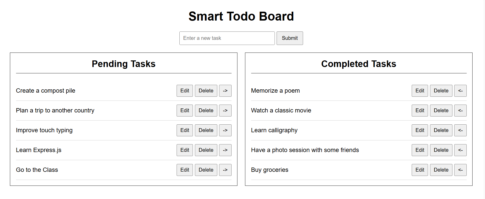

# Smart Todo Board

A dynamic Todo List application built with Vanilla JavaScript, HTML, and CSS.

The application uses the DummyJSON Todo API for CRUD operations and uses `localStorage` to keep task changes after a page refresh.

## Features

* Displays two lists:
  * Pending Tasks
  * Completed Tasks
* Fetches initial todo data from the DummyJSON API
* Add a new task
* Edit a task title inline
* Delete a task
* Move tasks between Pending and Completed using arrow buttons
* Uses Event Delegation for task action buttons
* Persists added, edited, deleted, and updated tasks using `localStorage`
* Uses a single local `todos` array as the application state


## Technologies Used

* HTML
* CSS
* Vanilla JavaScript
* Fetch API
* Async/Await
* DummyJSON Todo API
* Browser localStorage

## Project Structure

```text
smart-todo-board/
│
├── index.html
├── styles.css
├── api.js
├── index.js
└── README.md
```

## How It Works

1. When the application loads, it checks browser `localStorage`.
2. If saved todos exist, it displays those saved tasks.
3. If no saved todos exist, it fetches initial tasks from the DummyJSON API.
4. Todos with `completed: false` appear in Pending Tasks.
5. Todos with `completed: true` appear in Completed Tasks.
6. After any add, edit, delete, or toggle action, the local state is updated, saved to `localStorage`, and rendered again.

## API Endpoints Used

```text
GET    https://dummyjson.com/todos
POST   https://dummyjson.com/todos/add
PATCH  https://dummyjson.com/todos/:id
DELETE https://dummyjson.com/todos/:id
```

## Run the Project

1. Clone or download this repository.
2. Open the project folder in Visual Studio Code.
3. Start the project with the Live Server extension.
4. Open the application in your browser.

## Notes

DummyJSON is a mock API, so newly created todos are not permanently stored on its server. The application assigns unique local IDs to newly added tasks and saves all task changes in `localStorage`.
